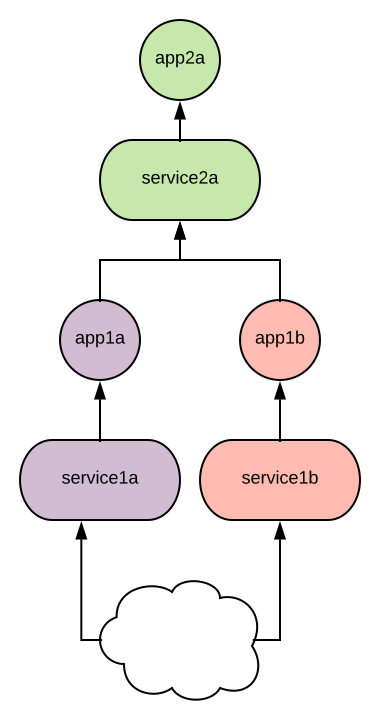

## What

Proof of concept to see whether it's possible to deploy two versions (app1a & app1b) of a microservice, and have them both rely on a single backing dependency (app2a)

This seems like it would be a useful way to facilitate cheap QA testing of certain changes in a microservice environment.

## How
### Start minikube
`minikube start`

### Set docker env
`eval $(minikube docker-env)`

### Build images
```
docker build -t app1a -f app1a/Dockerfile app1a
docker build -t app2a -f app2a/Dockerfile app2a
docker build -t app1b -f app1b/Dockerfile app1b
```

### Run the apps in minikube
```
kubectl apply -f app1a/k8s.yml
kubectl apply -f app2a/k8s.yml
kubectl apply -f app1b/k8s.yml
```

### Test
View the output of app1a by running: `minikube service app1a` You should see:
```
Hello from app1a and Hello from app2a!
```
Then check the second version of the service: `minikube service app1b`
```
Hello from app1b and Hello from app2a!
```
### Diagram



### Teardown
`minikube delete`
